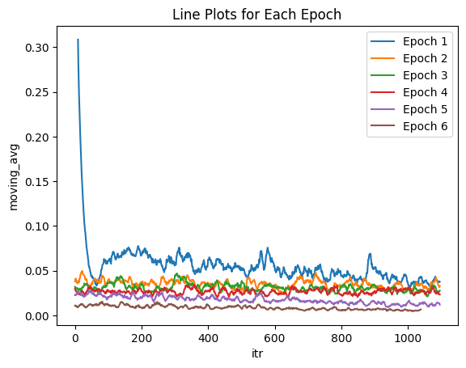

# I-JEPA X Fundus Image

PyTorch codebase for I-JEPA (the **Image-based Joint-Embedding Predictive Architecture**) published @ CVPR-23.
[\[arXiv\]](https://arxiv.org/pdf/2301.08243.pdf) [\[JEPAs\]](https://ai.facebook.com/blog/yann-lecun-advances-in-ai-research/) [\[blogpost\]](https://ai.facebook.com/blog/yann-lecun-ai-model-i-jepa/)

Pretraining with Diabetic Retinopathy Kaggle competition dataset. [\[Kaggle\]](https://www.kaggle.com/code/sayedmahmoud/diabetic-retinopathy-detection/input)

## Pretrained models

<table>
  <tr>
    <th colspan="1">arch.</th>
    <th colspan="1">patch size</th>
    <th colspan="1">resolution</th>
    <th colspan="1">epochs</th>
    <th colspan="1">data</th>
    <th colspan="3">download</th>
  </tr>
  <tr>
    <td>ViT-H</td>
    <td>14x14</td>
    <td>224x224</td>
    <td>300</td>
    <td>ImageNet-1K</td>
    <td><a href="https://dl.fbaipublicfiles.com/ijepa/IN1K-vit.h.14-300e.pth.tar">full checkpoint</a></td>
    <td><a href="https://dl.fbaipublicfiles.com/ijepa/IN1K-vit.h.14-logs-rank.0.csv">logs</a></td>
    <td><a href="https://github.com/facebookresearch/ijepa/blob/main/configs/in1k_vith14_ep300.yaml">configs</a></td>
  </tr>
</table>

## Code Structure (Root directory (local): C:\rsrch\240315_ijepa )

```
.
├── configs                       # directory in which all experiment '.yaml' configs are stored
├── src                           # the package
│   ├── train.py                  #   the I-JEPA training loop
│   ├── helper.py                 #   helper functions for init of models & opt/loading checkpoint
│   ├── transforms.py             #   pre-train data transforms
│   ├── datasets                  #   datasets, data loaders, ...
│   ├── models                    #   model definitions
│   ├── masks                     #   mask collators, masking utilities, ...
│   └── utils                     #   shared utilities
├── logs                          # Logs for the result
│   └── vith14.224-bs.2048-ep.300 #   Folder containing loss info
│      └── jepa_r0.csv            #      Csv file containing loss info
├── main_distributed.py           # entrypoint for launch distributed I-JEPA pretraining on SLURM cluster
├── main.py                       # entrypoint for launch I-JEPA pretraining locally on your machine
├── notebook_prompt.ipynb         # (JHA) Replacement for cmd. Run this first in order to pretrain I-JEPA with Fundus data. 
└── csv_analysis.ipynb            # (JHA) Plot the moving average of loss in each epoch.
```
## Data Structure (Root directory (local): C:\rsrch\240305_TorchDR )

```
.
└── Input                                 # 
    ├── aptos2019-blindness-detection     #  
    ├── diabetic-retinopathy-pre-training #  
    └── diabetic-retinopathy-resized      #
       ├── trainLabels.csv                # Csv recording the Diabetic Retinopathy level of each image
       └── resized_train                  #      
          ├── resized_train               # Resized fundus image. See the Kaggle link above for the definition of "resizing"
          └── train                       # Original fundus image
```

**Config files:**
Note that all experiment parameters are specified in config files (as opposed to command-line-arguments). See the [configs/](configs/) directory for example config files.

## Launching I-JEPA pretraining

### Single-GPU training
This implementation starts from the [notebook_prompt.ipynb](notebook_prompt.ipynb).

---

### Anaconda Environment (Requirements)
* Python 3.8.18
* Torch 2.2.1 + cu121
* torchvision
* Other dependencies: pyyaml, numpy, opencv, submitit
* GPU: Nvidia RTX A4000 x1/ CPU: Intel Core i9 (13th Gen)
* Cuda: 12.1, CuDNN: 8.9.7

---

### Pretrain loss  
Last updated: **03/26/2024 09:53** (UTC +09:00)

<p align="center">
  <a>
    
  </a>
</p> 
